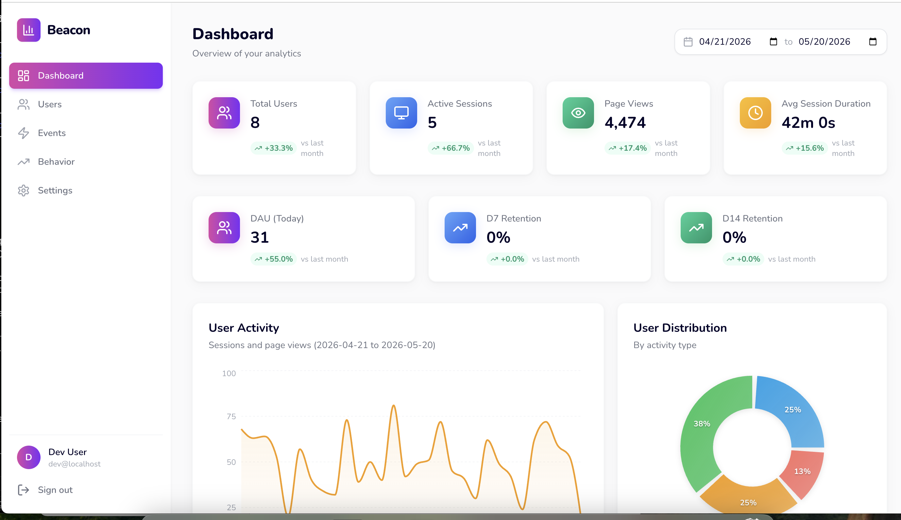
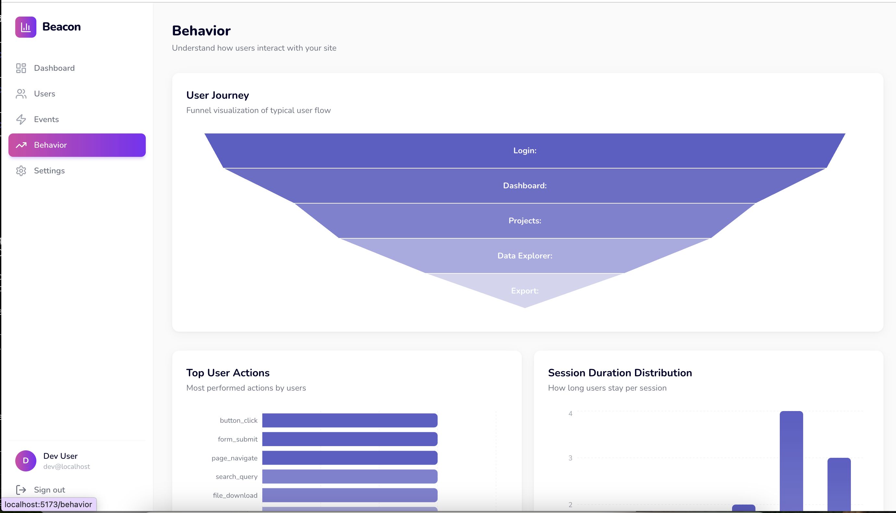

# Beacon

A better UI for Google Analytics. Beacon syncs your GA4 data into DynamoDB and presents it through a clean, fast dashboard with KPIs, charts, user profiles, event streams, and behavior analytics.

## Screenshots





## Features

- **Dashboard** — KPI cards (users, sessions, page views, avg duration, DAU, retention), activity area chart, user distribution donut, recent sessions table, top pages
- **Users** — user list with status, session counts, DAU trend, cohort retention
- **Events** — event timeline, filterable event stream with properties
- **Behavior** — user journey funnel, top actions bar chart, session duration distribution
- **GA4 sync** — pulls data from the GA4 Data API every 15 minutes into DynamoDB
- **Firebase Auth** — Google Sign-In with optional email allowlisting
- **Dev mode** — runs locally without any cloud credentials using built-in mock data
- **Date range picker** — filter dashboard data by custom date ranges

## Architecture

```
Frontend (React + Vite + Tailwind + Recharts)
    ↓ REST API (Bearer token)
Backend (Express + TypeScript)
    ↓                    ↓
DynamoDB (data store)    GA4 Data API (sync source)
    ↑
Firebase Auth (token verification)
```

```
backend/
  src/
    config.ts              → Environment-driven configuration
    index.ts               → Express server, routing, middleware
    middleware/auth.ts      → Firebase token verification
    routes/                → API route handlers (dashboard, users, events, behavior)
    services/
      data.ts              → Data adapter (auto-switches between mock and DynamoDB)
      dynamodb.ts          → DynamoDB queries
      ga4.ts               → GA4 Data API client
      sync.ts              → GA4 → DynamoDB sync orchestrator
      mock-data.ts         → In-memory mock data for local development
      cache.ts             → In-memory cache layer
    types.ts               → Shared TypeScript types
  scripts/
    create-tables.ts       → DynamoDB table creation script
frontend/
  src/
    firebase/index.ts      → Firebase Auth init + dev mode bypass
    context/AuthContext.tsx → Auth state management
    services/api.ts        → API client with token injection
    pages/                 → Dashboard, Users, Events, Behavior, Login
    components/            → Sidebar, KpiCard, ChartCard, DataTable
k8s/                       → Kubernetes manifests
Dockerfile                 → Multi-stage build (frontend + backend)
```

## Quick Start (Local Development)

No cloud credentials needed. Beacon auto-detects missing AWS/Firebase config and starts in dev mode with mock data.

### 1. Install dependencies

```bash
cd backend && npm install && cd ..
cd frontend && npm install && cd ..
```

### 2. Configure environment

```bash
# Backend — mock mode (no AWS or Firebase needed)
cp backend/.env.example backend/.env

# Frontend — dev mode (no Firebase needed)
cp frontend/.env.example frontend/.env
```

The defaults enable mock mode automatically.

### 3. Run

```bash
# Terminal 1 — backend
cd backend && npm run dev

# Terminal 2 — frontend
cd frontend && npm run dev
```

Open **http://localhost:5173**. You'll be auto-logged in as a dev user with mock data.

## Production Setup

### Google Analytics (GA4)

Beacon pulls data from the GA4 Data API. To connect your GA4 property:

1. **Create a service account** in [Google Cloud Console](https://console.cloud.google.com/iam-admin/serviceaccounts)
2. **Download the JSON key** file
3. **Grant access** in Google Analytics: Admin → Property Access Management → add the service account email as a **Viewer**
4. **Set environment variables:**

```bash
GA4_PROPERTY_ID=123456789
GOOGLE_APPLICATION_CREDENTIALS=./service-account.json
```

### Firebase Auth

Beacon uses Firebase Authentication for Google Sign-In:

1. **Create a Firebase project** at [Firebase Console](https://console.firebase.google.com)
2. **Enable Google Sign-In** under Authentication → Sign-in method
3. **Get your web app config** under Project Settings → General → Your apps → Web app
4. **Set backend env vars:**

```bash
FIREBASE_PROJECT_ID=your-project-id
GOOGLE_APPLICATION_CREDENTIALS=./service-account.json
```

5. **Set frontend env vars** (in `frontend/.env`):

```bash
VITE_FIREBASE_API_KEY=AIza...
VITE_FIREBASE_AUTH_DOMAIN=your-project.firebaseapp.com
VITE_FIREBASE_PROJECT_ID=your-project-id
VITE_FIREBASE_STORAGE_BUCKET=your-project.appspot.com
VITE_FIREBASE_MESSAGING_SENDER_ID=123456
VITE_FIREBASE_APP_ID=1:123456:web:abc123
```

The same Google Cloud service account works for both GA4 and Firebase Admin.

### DynamoDB

Beacon stores synced analytics data in four DynamoDB tables:

```bash
AWS_REGION=us-east-1
AWS_ACCESS_KEY_ID=AKIA...        # or use IRSA / instance profiles
AWS_SECRET_ACCESS_KEY=...
DYNAMODB_TABLE_PREFIX=beacon_    # creates beacon_sessions, beacon_events, etc.
```

Create the tables:

```bash
cd backend && npm run create-tables
```

This creates: `beacon_sessions`, `beacon_events`, `beacon_pageviews`, `beacon_users` with appropriate GSIs.

When running in Kubernetes with IRSA (IAM Roles for Service Accounts), you don't need explicit AWS credentials — the SDK picks them up automatically.

## Environment Variables

### Backend

| Variable | Description | Default |
|----------|-------------|---------|
| `PORT` | Server port | `3001` |
| `AWS_REGION` | AWS region for DynamoDB | `us-east-1` |
| `AWS_ACCESS_KEY_ID` | AWS access key (or use IRSA) | — |
| `AWS_SECRET_ACCESS_KEY` | AWS secret key (or use IRSA) | — |
| `DYNAMODB_TABLE_PREFIX` | Table name prefix | `beacon_` |
| `GA4_PROPERTY_ID` | Google Analytics 4 property ID | — |
| `GOOGLE_APPLICATION_CREDENTIALS` | Path to Google service account JSON | — |
| `FIREBASE_PROJECT_ID` | Firebase project ID for token verification | — |
| `ALLOWED_ORIGINS` | CORS origins (comma-separated) | `http://localhost:5173` |
| `ALLOWED_EMAILS` | Email allowlist (comma-separated, empty = allow all) | — |
| `SYNC_INTERVAL_MINUTES` | Minutes between GA4 sync runs | `15` |
| `CACHE_TTL_MS` | In-memory cache TTL in milliseconds | `960000` |
| `USE_MOCK_DATA` | Force mock mode (`true`/`false`, auto-detected) | — |

### Frontend

| Variable | Description |
|----------|-------------|
| `VITE_FIREBASE_API_KEY` | Firebase web API key |
| `VITE_FIREBASE_AUTH_DOMAIN` | Firebase auth domain |
| `VITE_FIREBASE_PROJECT_ID` | Firebase project ID (empty = dev mode) |
| `VITE_FIREBASE_STORAGE_BUCKET` | Firebase storage bucket |
| `VITE_FIREBASE_MESSAGING_SENDER_ID` | Firebase messaging sender ID |
| `VITE_FIREBASE_APP_ID` | Firebase app ID |
| `VITE_FIREBASE_MEASUREMENT_ID` | Firebase measurement ID |
| `VITE_API_URL` | Backend API URL | `http://localhost:3001/api` |
| `VITE_ALLOWED_EMAILS` | Email allowlist (comma-separated, empty = allow all) |

## Building

```bash
# Frontend
cd frontend && npm run build

# Backend
cd backend && npm run build

# Docker
docker build \
  --build-arg VITE_FIREBASE_API_KEY=... \
  --build-arg VITE_FIREBASE_AUTH_DOMAIN=... \
  --build-arg VITE_FIREBASE_PROJECT_ID=... \
  --build-arg VITE_FIREBASE_STORAGE_BUCKET=... \
  --build-arg VITE_FIREBASE_MESSAGING_SENDER_ID=... \
  --build-arg VITE_FIREBASE_APP_ID=... \
  -t beacon:latest .
```

The Dockerfile is a multi-stage build: frontend is compiled with Vite, backend with TypeScript, and the final image serves both from a single Node.js process.

## Deploying to Kubernetes

Manifests are in the `k8s/` directory.

### 1. Build and push the image

```bash
docker build -t your-registry/beacon:latest .
docker push your-registry/beacon:latest
```

### 2. Update the manifests

Edit `k8s/secret.yaml` with your credentials, `k8s/configmap.yaml` with your configuration, and `k8s/deployment.yaml` with your image registry.

Update `k8s/ingress.yaml` with your domain.

### 3. Apply

```bash
kubectl apply -f k8s/namespace.yaml
kubectl apply -f k8s/
```

### 4. (Optional) Google service account as a Kubernetes secret

```bash
kubectl create secret generic beacon-service-account \
  --from-file=service-account.json=./your-service-account.json \
  -n beacon
```

## API Endpoints

| Method | Path | Description |
|--------|------|-------------|
| GET | `/health` | Liveness/readiness probe |
| GET | `/api/dashboard` | Combined dashboard data (KPIs, charts, sessions, pages) |
| GET | `/api/dashboard/summary` | KPI summary only |
| GET | `/api/dashboard/activity` | Activity time series |
| GET | `/api/dashboard/distribution` | User distribution |
| GET | `/api/dashboard/recent-sessions` | Recent sessions |
| GET | `/api/dashboard/top-pages` | Top pages |
| GET | `/api/users` | All users with platform stats, DAU trend, retention |
| GET | `/api/users/:userId` | Single user detail |
| GET | `/api/events` | Events with timeline |
| GET | `/api/events/timeline` | Event timeline only |
| GET | `/api/behavior` | Top actions, session durations, user journey |
| POST | `/api/admin/sync` | Trigger manual GA4 sync |
| GET | `/api/admin/cache-stats` | Cache statistics |

All `/api/*` endpoints require a `Bearer` token in the `Authorization` header (Firebase ID token in production, `dev-token` in dev mode).

## License

Apache 2.0
